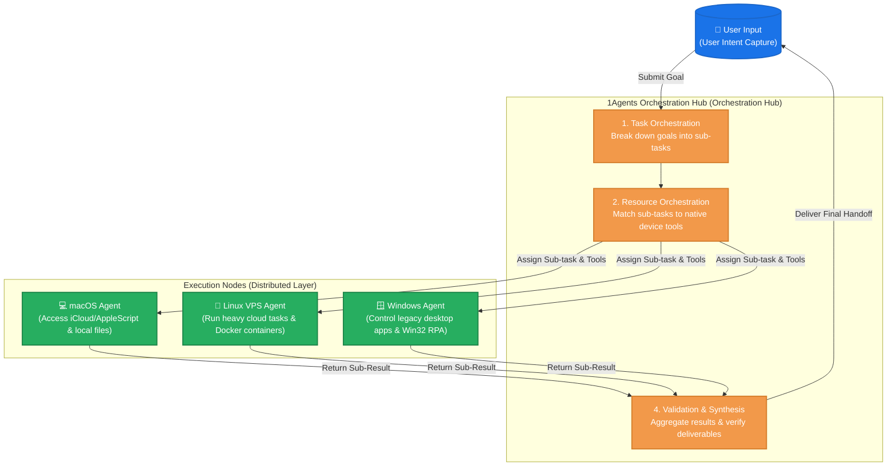

# 1Agents 🚀

### One is All, All is One — Open-source Distributed Agent System & Multi-device Collaboration Network
**1Agents (One Agents) is a next-generation open-source decentralized agent platform. It provides a unified workspace (Unified Portal) to manage, orchestrate, and collaborate with heterogeneous AI agents running across multiple physical or digital devices (macOS, Linux VPS, Windows, and IoT/embedded systems).**

[简体中文](README.md) | **English**

[](https://www.npmjs.com/package/@scottzx/1agents)
[](https://github.com/scottzx/1Agents)
[](LICENSE)

---

## 🌌 Branding & Vision

> **"One is All, All is One" (万物归一，一生万物)**
> —— This Zen philosophy is the core essence of **1Agents**. In the next era of AI, we no longer need endless isolated chat windows. Instead, we need a single unified intelligence hub that connects both the digital and physical worlds.

We are standing at a tipping point where **"AI will make everything compatible."** As system CLI tools, legacy applications, and desktop softwares become API-driven through lightweight middleware, AI agents are evolving into the universal adapters connecting all systems and hardware.

**1Agents** is far more than just a remote web terminal; it is an **Open-source Distributed Agent & Multi-device Collaboration Workspace**. It aims to dismantle hardware and location boundaries, allowing you to manage, coordinate, and hand off tasks seamlessly to agents running on heterogeneous host environments via a single browser view:
- **💻 macOS Node**: Serves as your "daily productivity workspace." It natively calls iCloud file synchronization, parses system logs, and runs AppleScript or Apple Shortcuts.
- **🐧 Linux VPS Node**: Acts as your "heavy cloud computing workhorse." Operating 24/7, it manages Docker containers, orchestrates backend tasks, and coordinates long-running server workers.
- **🪟 Windows Node**: Serves as your "specialist operator." It automates legacy, professional desktop software through UI automation and Win32 RPA.
- **🔌 Embedded & IoT Node**: Looking forward, it extends to the edge, reading sensors (GPIO) and sending signals to bring intelligence into physical workflows.

---

## 🧭 Project Status & Milestone Roadmap

**1Agents** is not a purely theoretical abstract network, but a highly practical, step-by-step developer workbench designed to scale into a decentralized intelligence hub.

### 1. What We Are Today
Today, 1Agents is a **lightweight, zero-configuration, multi-workspace remote Web dashboard** designed for modern developers and AI agents. It features an ultra-responsive web terminal (deeply integrated `ttyd + tmux`), a fully-featured file explorer with HTML/PDF high-definition preview, native Speech-to-Text, auto-generated SSL certificates, Tailscale Green Lock, and the CC-Connect chat bridge. It perfectly hosts, manages, and shields your local AI tooling workflow (such as `Claude Code`, `Codex CLI`, `OpenClaw`, etc.).

### 2. Next Major Milestone: 1Agents Distributed Orchestrator
Our next immediate focus is the **1Agents Distributed Task & Resource Orchestration Hub (Orchestration Hub)**. Rather than just a communication protocol, this is a complete workspace that implements the **"User Request ➡️ Intent Analysis ➡️ Multi-device Orchestration ➡️ Distributed Execution ➡️ Unified Synthesis & Feedback"** loop:

- **👤 User Intent Capture**: The user submits high-level goals or creative ideas through the Unified Portal (Web Browser / PWA / App).
- **📋 Task Orchestration**: The Orchestrator leverages LLMs to break down complex goals into structured, multi-step sub-tasks and dependency execution flows.
- **🧩 Resource & Agent Orchestration**: The Orchestrator queries available online nodes (macOS, Linux VPS, Windows) and matches sub-tasks to the best node based on their **heterogeneous host native capabilities** (e.g., dispatching file extraction to a macOS node, web deployment to a Linux node, or legacy app automation to a Windows node).
- **🛡️ Validation & Handoff**: Distributed nodes execute sub-tasks locally and stream output back. The Orchestrator verifies the deliverables, compiles the final result, and returns it to the user.



The underlying **Agent Protocol Network** acts as the secure, decentralized messaging pipe to support this multi-node orchestration. Through this loop, 1Agents delivers the true potential of distributed AI collaboration.

---

## 🌟 Core Capabilities & Technical Advantages

- ⚡ **Zero-Latency Web Terminal (ttyd + tmux integration)**:
  - Powered by `xterm.js` and high-performance WebSockets for instant keyboard responses.
  - **Persistent Terminal Sessions**: Integrated `tmux` state management. If your connection drops or you refresh your browser, your terminal state, running scripts, and histories are restored in milliseconds.
- 📂 **Full-Featured Web File Browser & Editor**:
  - **Fast Navigation**: Tree directories and tile views with quick search and type filters.
  - **Full Preview**: Native rendering of text and images. **Supports native HD preview of HTML & PDF files with a 16:9 fullscreen popout**.
  - **Online Coding**: Zero-config editor with syntax highlighting, support for renaming, saving, and downloading files directly.
- 📁 **Dynamic Multi-Workspace Management**:
  - Create, switch, and delete multiple workspaces on the fly.
  - **Native Folder Picker Integration**: Leverages the browser's native File System Access API to select and load any directory on your computer directly.
  - Context synchronization: Switching workspaces instantly and asynchronously updates both your terminal path and file view.
- 🎙️ **Native Speech-to-Text (STT) Input**:
  - Built-in Web Speech API supporting instant English and Chinese transcription for voice-controlled agent scripting.
- 🔒 **Zero-Config SSL/TLS Security**:
  - **Self-Signed Certificates**: Running `--ssl` automatically spins up a high-strength ECDSA P-256 self-signed certificate (valid for 10 years), adapting to all local LAN IPs.
  - **Tailscale Green Lock Integration**: Automatically scans and matches official Tailscale Let's Encrypt certificates to give you the secure green padlock `🔒` in your browser.
- 🤖 **CC-Connect Multi-Channel Bridge**:
  - Integrates with the [cc-connect](https://github.com/scottzx/cc-connect) engine to register workspaces as live projects.
  - Reverse proxies command control to Feishu, Telegram, Discord, and Slack, syncing agent theme styles and languages.
- 🌐 **On-Demand Web Tunnel**:
  - **One-Click Publishing**: Run with `--tunnel` or trigger via cc-connect to spin up a secure Cloudflare tunnel. No router port forwarding, firewall adjustments, or public IP configurations required.
  - **Zero-Install Cloudflare CLI**: Go backend auto-detects system environments. If `cloudflared` is missing, it downloads it safely with live progress logging (~30MB; 2-5s internationally, 15-30s in China). If already installed, it instantly launches in 0.1 seconds.
  - **Dynamic Authentication**: Auto-generates a secure access token and renders high-contrast QR codes in the terminal for instant mobile scanning.

---

## 📆 Weekly Git Highlights

The project has recently undergone major optimizations and refactoring, bringing these high-impact features:

1. **📄 HTML/PDF HD Preview**: The file manager now supports rendering HTML and PDF documents natively, with support for fullscreen 16:9 preview popouts.
2. **🎙️ Speech-to-Text & Compatibility Guidelines**: Integrated high-speed Speech-to-Text and published local offline engine compatibility guidelines (e.g., Safari's offline processing vs. Chrome's Google cloud dependence).
3. **🔒 Self-Signed ECDSA Certificates & Tailscale Autoloader**: Zero-config HTTPS with 10-year ECDSA P-256 cert generator, plus automated scanning for Tailscale network certificates.
4. **📱 Mobile Layout & tmux Gesture Upgrades**:
   - Removed bulky header bars to maximize screen estate on tablets and phones.
   - Upgraded mobile terminal Virtual Quick Keys, grouped controls, and integrated a direct `claude` CLI button.
   - Sliding menus now slide back smoothly on mobile workspace switching.
5. **⚙️ Native Folder Picker**: Replaced path text inputs with native operating system directory pickers.
6. **🚀 Parallel Workspace Loading**: Concurrently initializes terminals and workspace databases to drop first-screen white time.
7. **🤖 CC-Connect Proxied Handoff**: Dynamic workspace register, POST request theme syncing, and bridge proxy updates.
8. **📦 Multi-Platform NPM Wrapper (@scottzx/1agents)**: Released native binary packager wrapper supporting Node 24 and CI/CD automated Yarn 3 release pipelines.
9. **🌐 Smart Tunnel Downloader**: Reusable Cloudflare path lookups, terminal QR code printout, and 0.1-second subsequent startups.

---

## 🚀 Installation

### Method 1: Global NPM Install (Recommended ⚡)

We provide an automated wrapper packager. It auto-detects your platform architecture and downloads the optimized pre-compiled executable.

```bash
# Install globally (includes daemon, ttyd terminal backend, and Web dashboard assets)
npm install -g @scottzx/1agents

# Or execute on-demand without installing:
npx @scottzx/1agents [options]
```

> **Requirements**: Node.js >= 22 (supports Node 24)
> **Supported Platforms**: macOS (Darwin x64/arm64), Linux (x64/arm64), Windows (x64/arm64)

### Method 2: Manual Binary Release
Directly grab pre-compiled executables from our [GitHub Releases Page](https://github.com/scottzx/1Agents/releases), unzip, and run immediately.

### Method 3: Docker Deployment

```bash
docker run -d \
  -p 8080:8080 \
  -v /path/to/your/workspaces:/workspace \
  --name 1agents \
  scottzx/1Agents:latest
```

### Method 4: Compile from Source

To compile locally for development, ensure Yarn 3 is active:

1. **Compile the native C Terminal backend (ttyd)**:
   ```bash
   git clone --recursive https://github.com/scottzx/1Agents.git
   cd 1agents
   mkdir build && cd build
   cmake ..
   make  # Produces the ttyd binary
   ```
2. **Build Web dashboard frontend assets**:
   ```bash
   cd ../html
   corepack enable  # Ensure Yarn 3.6.3 runs
   yarn install
   yarn build       # Gulp packages assets and generates src/html.h
   ```
3. **Compile the Go Server Daemon**:
   ```bash
   cd ../agent
   go build -o 1agents ./cmd/agent/main.go
   ```

---

## 🛠️ CLI Flags & Usage

Starting the dashboard is extremely simple. Just execute `1agents` in your command line:

```bash
# Starts workspace server, default listening on :8080, mounting home directory (~)
1agents

# Listen on custom interfaces and mount custom work directories
1agents -listen 0.0.0.0:9000 -workdir /Users/scott/Projects
```

Open `http://localhost:8080` (or your listening port) in your browser to access your unified agent workspace!

### Comprehensive CLI Arguments

| Flag | Data Type | Default | Description |
| :--- | :---: | :---: | :--- |
| `-listen` | `string` | `":8080"` | Address and port to serve on (e.g. `0.0.0.0:8080` or `:9000`) |
| `-workdir` | `string` | `"~"` | Default root workspace folder mounted. Files outside this directory are secure |
| `-tmux-session` | `string` | `"1agents"` | Default tmux session name bound for state restoration and auto-reconnects |
| `-ssl` | `bool` | `false` | Enable HTTPS. Will auto-generate a 10-year cert if none is configured |
| `-ssl-cert` | `string` | `""` | Path to custom SSL/TLS Certificate file (PEM format) |
| `-ssl-key` | `string` | `""` | Path to custom SSL/TLS Private Key file (PEM format) |
| `-no-ttyd` | `bool` | `false` | Disable starting the backend ttyd server automatically (for dev testing) |
| `-ttyd-bin` | `string` | `"./ttyd"` | Path to custom `ttyd` binary executable |
| `-ttyd-addr` | `string` | `"127.0.0.1:7681"`| Loopback address for ttyd and Go daemon communications |
| `-restart-delay`| `duration` | `"3s"` | Cooldown period before trying to respawn a crashed ttyd daemon |
| `-max-restarts` | `int` | `5` | Threshold limit of consecutive ttyd crashes before locking to avoid loops |
| `-tunnel` | `bool` | `false` | Launch safe public Cloudflare tunnel, prints access link and mobile QR code |

---

## 💡 Advanced Setup & Guides

### 1. Configure LAN/WAN Let's Encrypt (Tailscale Setup)

Modern browsers enforce a **Secure Context** (requiring `localhost` or `HTTPS`) to access media device APIs (like Microphone for Speech-to-Text), Clipboard, or Service Workers. 

The easiest and safest way to obtain a valid HTTPS certificate on your private network is using **Tailscale**:

1. **Activate HTTPS Certs**: Enable **HTTPS Certificates** in your Tailscale Admin Console.
2. **Download Tailscale Certs**: In your host node terminal, execute:
   ```bash
   tailscale cert <your-tailscale-node-domain.ts.net>
   ```
3. **Move to Certs folder**: Place the output `.crt` and `.key` files inside `~/.1agents/certs/`.
4. **Boot with SSL**: Simply execute:
   ```bash
   1agents --ssl
   ```
   *The Go daemon automatically indexes and links the Tailscale certificate. You will get the green secure padlock 🔒 from any authorized phone or laptop on your Tailscale tailnet!*
   *(For details, read: [Tailscale Certificate Setup Guide](docs/tips/ssl-certificate-guide.md))*

### 2. Speech-to-Text Microphone Permissions & Troubleshooting

- **Safari (macOS) is Highly Recommended**: Safari uses macOS native offline speech transcription. It is **incredibly fast, works entirely offline without network delay, and is highly accurate**.
- **Chrome / Edge Network Errors**: Chrome/Edge relies on Google Cloud API for Web Speech transcriptions. If you run in isolated private networks or have firewall configurations, you will see `Speech recognition error: network`.
- **Mobile Access**: Speech-to-Text requires active HTTPS/SSL on mobile devices to gain microphone access.
- *(For details, read: [Speech Recognition Compatibility Notes](docs/tips/voice-recognition.md))*

### 3. Zero-Config Tunnels (Cloudflare & CC-Connect)

When running in restricted environments with no public IP or firewall access (like home routers, corporate internal networks, or public cafe Wi-Fi), `1Agents` offers a dead-simple public tunnel:

#### 💡 Behind the scenes & First Download Experience
Booting with the `-tunnel` flag:
```bash
1agents -tunnel
```
System automatically triggers the tunnel workflow:
1. **Intelligent Path Discovery**: Checks if `cloudflared` is already installed in the path (e.g., via Homebrew on macOS or `apt` on Linux). If found, it **instantly boots in 0.1 seconds, skipping downloads**.
2. **On-Demand Secure Download**: If missing, Go downloads it (~30MB) from the official GitHub Release page. **Real-time percentages and progress bars** are logged to the console.
   - *High-speed Broadband*: Takes **2 ~ 5 seconds** and prints the QR code.
   - *Restricted Network*: Taking roughly **15 ~ 30 seconds**.
   - *Subsequent Launches*: Launches in **0.1 seconds** using the local cached binary.
3. **Secure Mobile Connect**: Prints a high-contrast QR code directly in the terminal, allowing any scanned mobile device to safely tunnel into your console.

#### 🤖 CC-Connect Chat Activation
If you have [cc-connect](https://github.com/scottzx/cc-connect) active, you don't even need terminal access. **Just ping your custom Feishu, Slack, or Telegram chatbot with "Launch my workspace" or "Start tunnel", and the backend automatically pulls up the tunnel and replies with a secure, temporary HTTPS link.**

---

## 📄 License

This project is licensed under the [MIT License](LICENSE).

---

**Acknowledgements**:
- Terminal xterm emulation is built upon the wonderful open-source server [ttyd](https://github.com/tsl0922/ttyd).
- Remote platform chat bridges and project sync are driven by the [cc-connect](https://github.com/scottzx/cc-connect) module.
