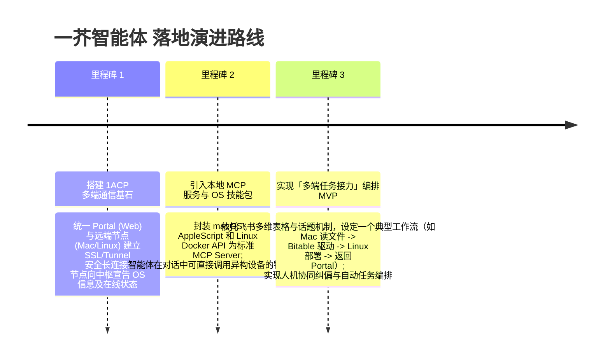

# 一芥智能体协同系统 (1Agents) 落地技术实现蓝图 V1.1 🚀

> [!IMPORTANT]
> **定位与目标**：
> **一芥智能体 (1Agents)** 旨在成为一个完全开源、去中心化、自托管的 **分布式智能体调度与任务编排中枢**。我们不依赖任何第三方闭源云端，而是通过本地 Go 守护进程（1agents daemon）、多端通信协议、以及宿主机 OS 级工具箱，实现异构节点（macOS、Linux、Windows、IoT）的高效协同。

---

## 💡 一、 核心决策：借力飞书生态快速验证 ➡️ 未来开源平替路线

针对目前阶段的核心系统设计，我们做出了一个非常务实的战术取舍：

### 1. 为什么在当前阶段（V1.1）选择飞书？
*   **避免过度设计，聚焦核心逻辑**：在项目早期，去从零构建一套高可靠、高并发、支持移动端流式推送的分布式 IM 与多维数据看板，工程量极其庞大。
*   **借力成熟基础设施**：飞书提供了国内最一流的商业级开放能力，包括飞书应用、多维表格（Bitable）API、话题群聊（Thread）机器人等。
*   **小米实践已验证成功**：小米零售团队通过飞书多维表格与话题架构，在数百人规模内成功跑通了 AI 协同闭环。我们“借力打力”可以实现极快的开发验证速度，用最少的时间跑通我们的调度与资源匹配模型。

### 2. 未来的“去中心化与开源平替”演进策略
*   **临时解耦，不作深度绑定**：在代码设计上，我们会通过适配器模式对飞书进行隔离。**一芥智能体** 核心的任务状态机与资源编排逻辑仍然纯净地保存在 Go 后端中。
*   **第二阶段平替规划**：一旦这套“多维表 + 话题”的分布式协同逻辑被业务场景充分验证成功，我们将在后续版本中讨论和探索开源的平替消息通道与数据看板。例如：
    *   **消息通道平替**：探索对接开源的 **Matrix** 协议、**Discord/Slack** 网关，或者使用我们自研的 Unified Portal Web UI 实时通信面板。
    *   **看板平替**：使用自建的轻量级 Web 数据报表或对接开源的多维数据库。
*   **当前原则**：今天我们故意“不做太重的通信层设计”，快速借力飞书，快速小步快跑，快速完成 MVP！

> 📌 **本方案设计参考与致谢**：
> *   小米技术团队实践：[《从个人提速到团队提效：小米 AI Coding 工程化实践》](https://mp.weixin.qq.com/s/l5qeFWtXtaStweOqLP7RKA)

---

## 二、 一芥智能体 (1Agents) 核心分层架构

对比扣子 3.0，一芥智能体将核心的“编排与调度大脑”下沉到用户可控的本地守护进程或自托管集群中：

```
┌─────────────────────────────────────────────────────────────────────────┐
│            一芥智能体 统一门户（Unified Portal / Browser UI）           │
│  • 任务生命周期监控  • 多端终端矩阵展示  • 联合文件系统视图（P2P/HTTP）  │
└─────────────────────────────────────────────────────────────────────────┘
                                     │  WebSocket / gRPC (1ACP 协议)
┌─────────────────────────────────────────────────────────────────────────┐
│       一芥智能体 任务与资源编排中枢（Orchestration Hub - Go 守护进程）   │
│  • LLM 任务智能拆解（DAG 编排）  • 节点资源画像与动态匹配（Mac/Linux/Win） │
│  • 状态监控与执行结果统一验收    • 集成 MCP Client（Model Context Protocol）│
└─────────────────────────────────────────────────────────────────────────┘
                                     │  1ACP 协议 / Secure Tunnel / Tailscale
┌─────────────────────────────────────────────────────────────────────────┐
│              异构设备本地守护进程（1Agents Host Daemon）                │
│  • 维护本地执行会话（Session Map） • 监测节点 CPU/网络负载状态          │
│  • 统一桥接本地 Agent（如 Claude Code, Codex）与本地 MCP Server        │
└─────────────────────────────────────────────────────────────────────────┘
                                     │  OS Native Tools / Bridge API
┌─────────────────────────────────────────────────────────────────────────┐
│                      系统原生硬件/软件工具箱（Host Toolpacks）         │
│  【macOS】iCloud/AppleScript  【Linux】Docker/Cron  【Windows】Win32 RPA │
└─────────────────────────────────────────────────────────────────────────┘
```

---

## 三、 四大核心落地板块

### 1. 智能体互联协议层 —— 1ACP (1Agents Connection Protocol)
一芥智能体将定义一个开放的 **1ACP 协议**：
*   **节点自主宣告 (Dynamic Service Discovery)**：每个安装了 `1agents` 的宿主机（Mac/Linux/Windows）在启动时，通过 Tailscale 内网或 Cloudflare Tunnel 安全发布，并向编排中枢注册自己。
*   **能力画像宣告 (Capability Payload)**：节点在注册时，会宣告其特有的工具生态（如 `OS=darwin`，带 `iCloud=true`，`AppleScript=true`；`OS=linux`，带 `Docker=true` 等）。
*   **JSON-RPC 双向流**：采用持久化 WebSocket 或 gRPC，支持任务派发、进度流式回传（streaming）、以及跨设备的命令协作。

---

### 2. 异构设备原生工具箱 —— Host Toolpacks
这是一芥智能体最具想象力的护城河。AI 兼容一切的物理基础，在于**把原生的操作系统能力“工具化”（Toolification）**：
*   **macOS Toolpack**：
    *   **iCloud 同步监听**：智能体可监测 `~/Library/Mobile Documents/com~apple~CloudDocs`，自动读取或写入跨设备云文件。
    *   **AppleScript & Shortcuts**：编写轻量桥接，允许智能体直接拉起 Mac 本地原生 App（如 Keynote, Mail）执行操作。
*   **Linux VPS Toolpack**：
    *   **Docker 编排工具**：智能体可调用本地 Docker API，一键拉起容器、配置 nginx 反向代理、部署测试网页。
    *   **Cron 计划任务**：允许智能体在本地配置 Crontab，执行 24 小时无人值守的任务。
*   **Windows Toolpack**：
    *   **Win32 UI Automation (RPA)**：包装 Python-pywinauto 或 Autohotkey，让智能体能够直接操控如 CAD、专业财务软件等无 API 的传统 Windows 桌面端程序。

---

### 3. 任务与资源编排引擎 —— Orchestration Engine (飞书多维表格 + 话题驱动)
依托飞书 CLI（cc-connect）的多维表格（Bitable）与话题（Thread）机制，构建一个轻量、透明、且支持人机协同的分布式编排方案：

*   **📊 飞书多维表格（Bitable）进行任务与资源编排**：
    *   **资源状态注册表 (Resource Registry & Status)**：在多维表格中建立“可用节点表”，动态记录注册的异构机器（Mac、Linux、Windows）、它们具备的原生系统工具（iCloud, Docker, Win32 RPA）以及当前运行负载与在线状态。
    *   **任务拆解与调度表 (Task Dispatch & Queue)**：当用户输入总目标时，一芥智能体调度中枢（由 Go 守护进程的 LLM 编排器驱动）智能拆解任务并生成“多维任务表格”，每一行代表一个子任务步骤、依赖的前置步骤、指派的硬件节点、执行状态（待执行、进行中、已完成、**已堵塞**）以及产出物链接。
    *   **状态与堵塞可视化**：多维表格天然是一个可视化的状态机。任何人或 AI 都可以通过修改表格状态直接干预流程，如果某一步因为网络或代码报错被标记为 `已堵塞`，用户和调度中枢能瞬间一目了然。

*   **💬 飞书话题（Thread）作为并行任务传递与人工干预中心 (Human-in-the-Loop)**：
    *   **话题是并行推进的最小治理单元**：在需求群中为每一个被拆解的子任务步骤建立独立的 **“飞书话题”**。每个话题完美包裹住它自己的上下文、执行进度、参与者与本地 Agent。
    *   **动态人机协同（Human Intervention）**：大语言模型中枢在拆解任务时难免会有遗漏，或在异构设备执行中出现意料之外的报错。此时，**人类可以直接在对应子任务的话题中发表评论介入**（例如：*“这个路径错了，去读 iCloud 目录下的 sales_v2.pdf 吧”* 或 *“帮我补充一个功能逻辑”*）。
    *   **决策回流与二次调度**：智能体在话题中接收人类的反馈指令后，在本地执行修正，随后更新多维表格的状态，触发编排中枢进行下一步的自动任务接力。这完美解决了“决策回流”和“AI 在终端里闭门造车”的痛点。

---

### 4. 彻底拥抱 MCP (Model Context Protocol) 替代封闭 Skills
扣子的 Skills 只能依赖官方 CDN，且无法本地动态热加载。一芥智能体应当**全量拥抱 Anthropic 推出的 MCP 行业标准协议**：
*   **MCP 宿主与客户端双轨**：
    *   一芥智能体 Go 守护进程作为 **MCP Client**，可以直接挂载互联网上成千上万公开的 MCP Server（如 GitHub, Brave Search, Postgres）。
    *   各异构节点作为 **MCP Server**，将各自的 OS 原生工具（如 AppleScript, Win32 RPA）封装为标准的 MCP Tools 接口。
*   **热加载机制（Hot Reload）**：
    *   开发者只需在一芥智能体门户中填入一个 MCP Server 的 GitHub 地址或本地可执行文件路径，系统无需重启，即可瞬间在智能体对话中激活全新技能。

---

## 四、 统一门户工作台 —— Unified Portal Web UI
我们现有的前端系统需要从“单会话终端”升级为“集群协同驾驶舱”：
*   **协同视图（Collaboration Panel）**：可以看到正在串联执行的任务 DAG 图，实时高亮当前正在执行的设备节点（如“Mac Node 正在运行提取...” ➡️ “Linux Node 正在跑数据库...”）。
*   **联合文件系统（Federated File Explorer）**：
    *   左侧树形图不再只能看当前机器。它可以切换节点，以统一的 UI 浏览 Mac、Linux VPS 和 Windows 上的工作目录。
    *   支持跨节点拖拽传输文件。
*   **终端矩阵（Terminal Matrix）**：利用现有的极速 `ttyd+tmux`，支持多分屏或 Tab 切换，允许用户在同一个网页中随时切入任何一个节点的真实本地 shell，进行手动干预或 Debug。

---

## 五、 第一阶段落地演进路线 (Phase 1 Roadmap)

为了快速验证并做出最惊艳的 MVP，我们建议分三步走：



*   **里程碑 1：搭建 1ACP 多端通信基石**
    *   利用现有的 Go 守护进程，使两个不同的 `1agents` 实例（如本地 Mac 和远端 Linux VPS）能够通过 Tailscale 内网或 Cloudflare Tunnel 安全握手。
    *   在 Portal 前端能同时看到两个节点的在线状态和系统信息。
*   **里程碑 2：引入本地 MCP 服务与 OS 技能包**
    *   将 macOS 上的 AppleScript（如控制浏览器、截屏）和 Linux 上的命令行工具，封装成最简单的标准 **MCP Server**。
    *   在一芥智能体终端里，智能体能够调用这些设备特有的工具。
*   **里程碑 3：实现首个「多端任务接力」编排 MVP**
    *   结合飞书多维表格和话题机制，设计一个经典闭环场景：用户在网页输入需求 ➡️ Mac 节点读取本地文件并记录多维表 ➡️ 通过 1ACP发送给 Linux VPS 节点 ➡️ Linux 节点用 Docker 拉起运行 ➡️ 多维表自动更新状态 ➡️ 过程中若出错支持在飞书话题下追加指令纠正，最终回传成功结果。
