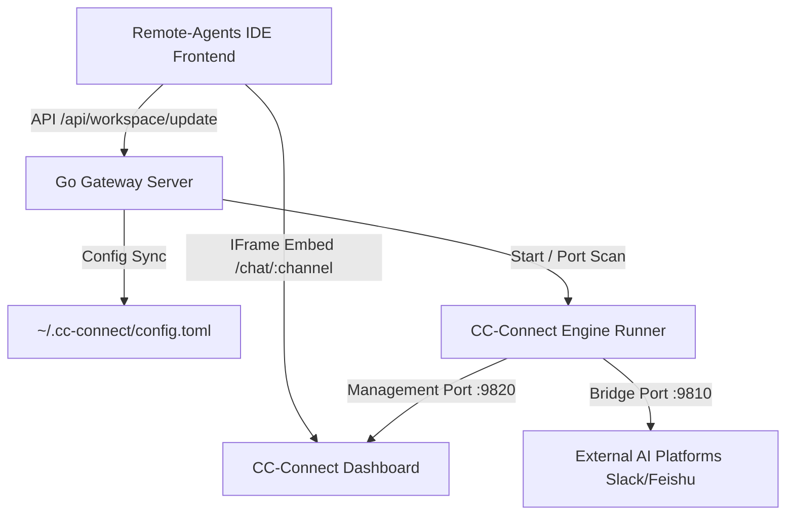

# Implementation Plan - Seamless Multi-Channel & Workspace Integration (CC-Connect)

This plan outlines the merging of the `cc-connect` multi-channel platform with our `remote-agents` IDE. It details how we establish a robust **1-to-1 mapping** where each Workspace in the IDE can be individually configured with its own custom **Terminal Folder** and **AI Chat Channel**.

---

## Technical Architecture

The integration leverages a Git Submodule structure to guarantee clean boundaries, portability, and dynamic runtime bindings.



---

## User Review & Decision Points

> [!IMPORTANT]
> - **Git Submodule Source Linking**: We will register `cc-connect` as a Git Submodule at the root directory of `remote-agents` (`/cc-connect`) using the user's local directory `/Users/scott/Documents/01-开发项目/AI应用/cc-connect`.
> - **1-to-1 Workspace Mapping & URL Router**:
>   - Setting **AI 聊天频道 (Chat Channel)** on a workspace will cause the **AI 渠道** iframe to boot directly into `/chat/{chatChannel}` in CC-Connect.
>   - If blank, it defaults to the project's management page `/projects/{workspaceName}` to allow channel/platform configuration.
> - **Custom Terminal Folder (Terminal Directory)**:
>   - Setting **终端文件夹 (Terminal Folder)** overrides the default workspace path for all newly spawned terminal/tmux windows, allowing dedicated workspace runtime directories.

---

## Proposed Changes

### 📁 Git Submodule Creation

Run the following command at the root of `remote-agents`:
```bash
git submodule add /Users/scott/Documents/01-开发项目/AI应用/cc-connect cc-connect
```

---

### 🐹 Go Backend Core & API Integration

#### [MODIFY] [go.mod](file:///Users/scott/Documents/01-开发项目/Web应用/remote-agents/agent/go.mod)
- Append the relative submodule replacement directory:
  ```go
  replace github.com/chenhg5/cc-connect => ../cc-connect
  ```
- Declare dependency `github.com/chenhg5/cc-connect v0.0.0` in the `require` block.

#### [MODIFY] [handler.go](file:///Users/scott/Documents/01-开发项目/Web应用/remote-agents/agent/internal/workspace/handler.go)
- Extend the `Workspace` struct to include custom terminal folder and chat channel configurations:
  ```go
  type Workspace struct {
      ID          string `json:"id"`
      Name        string `json:"name"`
      Path        string `json:"path"`
      Status      string `json:"status"`
      TerminalDir string `json:"terminalDir,omitempty"` // Custom terminal folder
      ChatChannel string `json:"chatChannel,omitempty"` // CC-Connect Chat Channel / Session Key
  }
  ```

#### [NEW] [runner.go](file:///Users/scott/Documents/01-开发项目/Web应用/remote-agents/agent/internal/ccconnect/runner.go)
- Bootstrap a `ccconnect` package.
- Scan for free ports starting at `9820` (Management) and `9810` (Bridge Protocol).
- Automatically instantiate/bootstrap a unified `~/.cc-connect/config.toml` config file with sensible defaults and auto-inject/synchronize workspaces into the `[[projects]]` block.
- Start management API services and bridge engines asynchronously.

#### [MODIFY] [server.go](file:///Users/scott/Documents/01-开发项目/Web应用/remote-agents/agent/internal/server/server.go)
- Hook up dynamic route `/api/cc-connect/url?workspace=XXX&theme=YYY`:
  - Find the workspace by ID `XXX`.
  - Resolve its `ChatChannel`. If set, return redirect URL `http://localhost:{port}/login?token={secret}&redirect=/chat/{chatChannel}&theme={theme}`.
  - If unset, default redirect to project detail `/projects/{workspaceName}`.

#### [MODIFY] [main.go](file:///Users/scott/Documents/01-开发项目/Web应用/remote-agents/agent/cmd/agent/main.go)
- Boot the supervisor `go ccconnect.Start(ctx)` before launching the HTTP server.

---

### ⚛️ Preact Frontend UI Integration

#### [MODIFY] [types.ts](file:///Users/scott/Documents/01-开发项目/Web应用/remote-agents/html/src/components/types.ts)
- Add `terminalDir` and `chatChannel` optional properties to interface `Workspace`:
  ```typescript
  export interface Workspace {
      id: string;
      name: string;
      path: string;
      status: string;
      terminalDir?: string;
      chatChannel?: string;
  }
  ```
- Extend `activeTab` to support `'channels'`:
  ```typescript
  export type ActiveTab = 'terminal' | 'agents' | 'console' | 'folders' | 'channels';
  ```

#### [MODIFY] [app.tsx](file:///Users/scott/Documents/01-开发项目/Web应用/remote-agents/html/src/components/app.tsx)
- **Modal Upgrades**: Add fields "终端文件夹" and "AI 聊天频道" in `wsModalOpen` form. Hook them up to `wsModalTerminalDir` and `wsModalChatChannel` state variables.
- **Save Hooks**: Update `createWorkspace` and `updateWorkspace` to transmit the new configuration parameters to the backend.
- **Terminal Launch**: Pass `ws.terminalDir || ws.path` as the target directory inside `selectWorkspace` when spawning terminal sessions.
- **IFrame Routing & Live Theme Dispatch**:
  - Request `/api/cc-connect/url?workspace=XXX&theme=YYY` to load the appropriate iframe target on mount or tab toggle.
  - Dispatch a parent-to-child `postMessage` containing theme mutations (`THEME_CHANGE`) dynamically to avoid iframe reloads.

#### [MODIFY] [LeftSidebar.tsx](file:///Users/scott/Documents/01-开发项目/Web应用/remote-agents/html/src/components/sidebar/LeftSidebar.tsx)
- Pass `ws.terminalDir || ws.path` to `onTerminalCreate` callback instead of the fixed `ws.path` root.

#### [MODIFY] [WorkspaceHeader.tsx](file:///Users/scott/Documents/01-开发项目/Web应用/remote-agents/html/src/components/header/WorkspaceHeader.tsx)
- Place the **AI 渠道 (Channels)** action button in the header group (left of files). When clicked, toggle the viewport to `'channels'` and auto-collapse the drawer.

#### [MODIFY] [MiddleCanvas.tsx](file:///Users/scott/Documents/01-开发项目/Web应用/remote-agents/html/src/components/canvas/MiddleCanvas.tsx)
- Add the `iframe` renderer when `activeTab === 'channels'`, referencing `id="cc-connect-iframe"`.

---

### 🎨 CC-Connect Adaptations

#### [MODIFY] [Login.tsx](file:///Users/scott/Documents/01-开发项目/AI应用/cc-connect/web/src/pages/Login.tsx)
- Capture the `redirect` URL search parameter in the auto-login hook and route directly to it (e.g. `/chat/{chatChannel}`) instead of hardcoded `/`.

#### [MODIFY] [theme.ts](file:///Users/scott/Documents/01-开发项目/AI应用/cc-connect/web/src/store/theme.ts)
- Parse `?theme=` during initial store initialization.
- Register an event listener for postMessage `THEME_CHANGE` messages to apply real-time styles without refreshing.

---

## Verification Plan

### 1. Verification of Terminal Working Directory
- Configure a workspace with `terminalDir` set to `/Users/scott/Documents/.../remote-agents/agent/internal`.
- Launch a new terminal tab and confirm it opens directly inside `internal/` by typing `pwd`.

### 2. Verification of 1-to-1 Chat Channels
- Configure a workspace with `chatChannel` set to `slack-main-group`.
- Click on **AI 渠道** and verify that the embedded iframe successfully auto-authenticates and navigates directly to `/chat/slack-main-group`.
- Toggle between light/dark themes and confirm the embedded UI adapts theme colors instantly.
